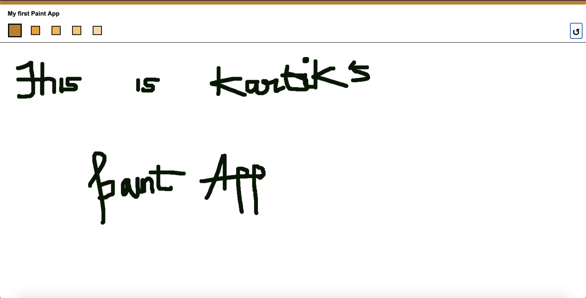

# Learn-React-Hooks-In-An-Hour
So, I'm not sure if anyone is reading this but if you are, I recently learned react using class components but then I learned that react switched to hooks, so learn that today. Yay!
So this is a paint app that we built. Take a look at image below to understand what the code does.
For more info on how to run it, Check the paint app folder.

